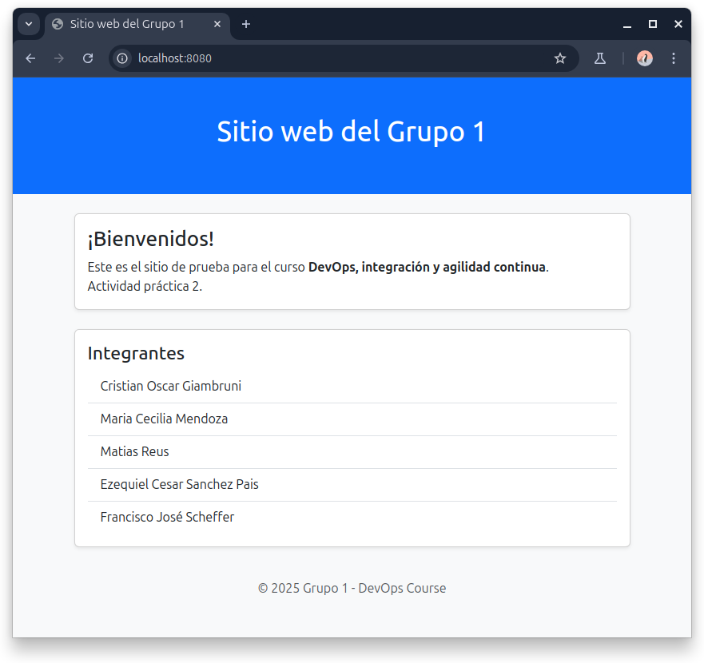

## Sitio de prueba - Grupo 1
Aplicación web de prueba para actividades prácticas grupo 1 curso UTN DevOps.

## Instrucciones para levantar app

La siguiente aplicación es para leer de una base de datos los nombres de los integrantes

### Requisitos:

- Docker
- Docker Compose
- Git


### Descargar repositorio:

```bash
git clone https://github.com/kity-linuxero/devops-web-actividad1.git
```

### Cambiar al branch para actividad 2
```bash
cd devops-web-actividad1
git switch node-version-db
```

### Construir las imágenes

```bash
docker compose --build
```

### Levantar app


```bash
docker compose up -d
```

### Comprobar funcionamiento

Acceder a [localhost:8080](http://localhost:8080)




## Troubleshooting

En caso que algo no salga bien, puede realizar las siguientes comprobaciones:

#### Verificar que la base de datos se creó correctamente

```bash
docker exec -it postgres-container psql -U admin -d grupo1 -c "SELECT * FROM participantes;"
```

### Verificar la API del backend

```bash
curl http://localhost:8080/api/participantes
```

En ambos casos debe devolver el nombre de los integrantes.

## Eliminar datos

Puede eliminar contenedores y volúmenes creados con:

```bash
docker compose down -v
```

